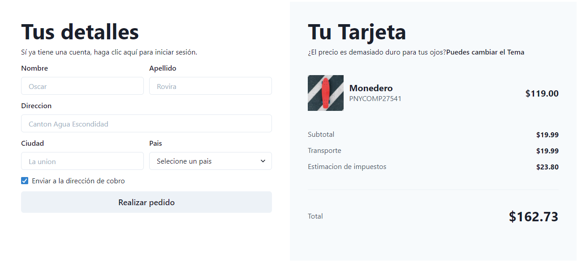
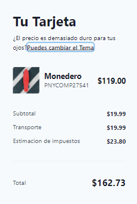
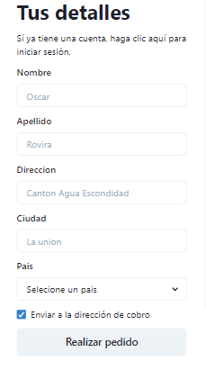
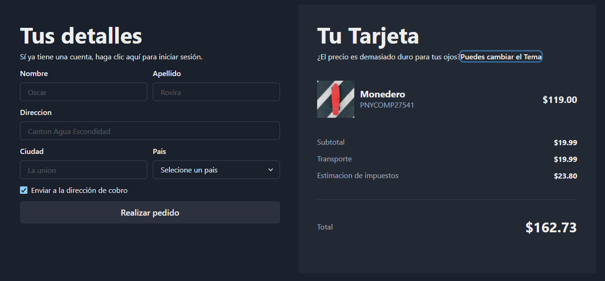
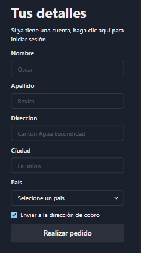

# mini proyecto web

proyecto para aprender a utilizar https://chakra-ui.com/

## ejemplos de pantallas modo claro :

### pantalla de computadora

### pantallas de movil

## emeplos de pantallas modo oscuro

### pantalla de computadora

### pantallas de movil

